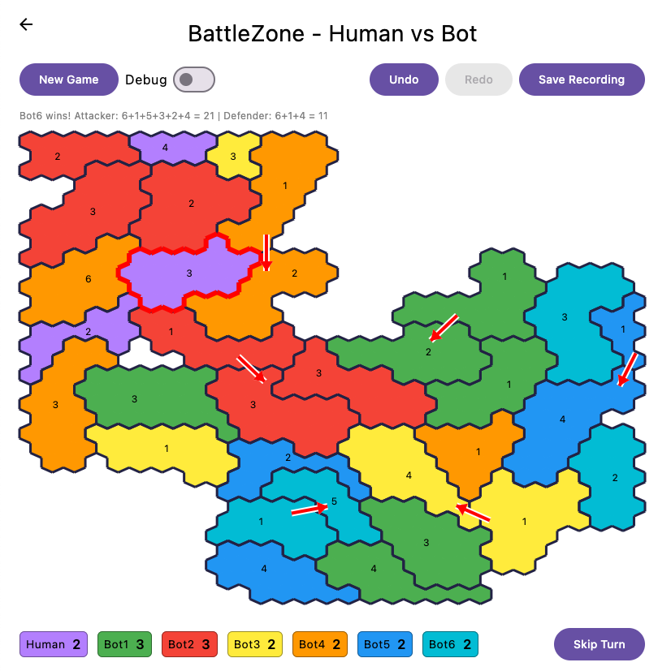

# BattleZone

A territory control game similar to Risk or Dice Wars, built with Kotlin Multiplatform and Compose Multiplatform.



# Motivations and inspiration

I enjoyed playing a quick game of [Dice Wars](https://www.chrisraff.com/dicewars/), but eventually I became frustrated with how unbalanced
the gameplay is. For example in 1 vs 1 games the player who attacks first has a huge advantage.

I also wanted to make the game more challenging by improving the abysmal play level of the bots.
In future versions there will be support for high speed bot tournaments, so that the play level
of the bots can be evaluated.

To speed up implementation the initial map generation and rendering code was translated by Claude Code from Chris Raff's javascript version https://github.com/chrisraff/dicewarsjs.

The code has been written in AI engineering mode, using Claude Code, or Codex.

## Gameplay

Players compete to control all territories on a hexagonal board by rolling dice to attack adjacent enemy territories.
The player with the higher dice total wins each battle. Armies are reinforced each round based on territories controlled.

- **2–8 players** (human and/or bots)
- **Dice-based combat**: compare totals to determine the winner
- **Turn-based or real-time** modes.
- **Procedurally generated** hex maps

### Game Flow

1. Select game mode: Human vs Bot or Bot vs Bot
2. Select player count (2–8)
3. Attack adjacent enemy territories or skip your turn
4. When all active players skip, armies are reinforced
5. Last player controlling all territories wins

## Platform Support

| Platform      | Status                          |
|---------------|---------------------------------|
| Desktop (JVM) | ✓                               |
| Android       | ✓                               |
| iOS           | requires Xcode, and is untested |
| Web (WASM)    | ✓                               |
| Web (JS)      | untested                        |

## Tech Stack

- **Language**: Kotlin 2.3.0
- **UI**: Compose Multiplatform 1.9.3 (Material3)
- **Server**: Ktor 3.3.3 (will be implemented with human multi-player mode)
- **Build**: Gradle with Kotlin DSL

## Project Structure

```
BattleZone/
├── composeApp/   # Compose Multiplatform UI (all platforms)
├── shared/       # Core game logic (platform-agnostic)
└── server/       # Ktor backend server (JVM), will be implemented with human multi-player mode
```

## Building and Running

All commands are run from the `BattleZone/` directory.

### Desktop

```bash
./gradlew :composeApp:run
```

### Android

```bash
./gradlew :composeApp:assembleDebug
```

### iOS

Untested

Open `iosApp/` in Xcode and run from there.

### Web (WASM — recommended)

```bash
./gradlew :composeApp:wasmJsBrowserDevelopmentRun
```

### Web (JS — legacy browser support)

Untested

```bash
./gradlew :composeApp:jsBrowserDevelopmentRun
```

### Server

Untested

```bash
./gradlew :server:run
```

### Tests

```bash
./gradlew test
```

## Requirements

- Java 21
- Xcode (iOS builds only)
