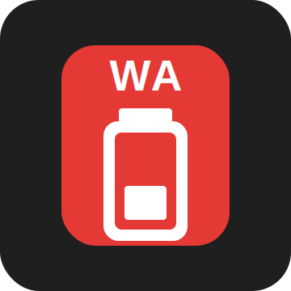
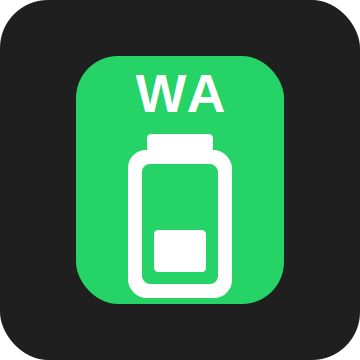

# WhatsApp Settings Widget

A tiny Android home-screen widget that helps monitor whether WhatsApp is configured for unrestricted background battery usage.

The widget is designed as a 1x1 launcher tile with a `WA` label and vertical battery icon:

| Unrestricted | Restricted |
| --- | --- |
|  |  |

## What the colors mean

- **Red**: WhatsApp is **unrestricted** / ignoring battery optimizations. This is the battery-drain risk state.
- **Green**: WhatsApp is **restricted or optimized** in the sense that it is **not unrestricted**. This includes Android's optimized/default battery mode.
- **Gray**: WhatsApp is not installed.

## Important Android API limitation

Android does not provide a stable public API that lets one normal app read another app's exact **Allow background usage** switch state.

This app uses the public API:

```kotlin
PowerManager.isIgnoringBatteryOptimizations("com.whatsapp")
```

That API can reliably detect whether WhatsApp is **unrestricted**. It cannot distinguish between:

- Allow background usage enabled + optimized
- Allow background usage disabled

For that reason, the green state means **restricted or optimized**, not necessarily that Android's exact Allow background usage switch is off.

## Behavior

- Tapping the widget opens the app.
- The app has a button to open WhatsApp's Android app settings page.
- When returning to the app, the widget is refreshed immediately.
- The widget also refreshes periodically using WorkManager.

## Build and test

```bash
./gradlew test assembleDebug assembleDebugAndroidTest
```

## Package target

The app monitors the regular WhatsApp package:

```text
com.whatsapp
```

WhatsApp Business (`com.whatsapp.w4b`) is not currently monitored.
